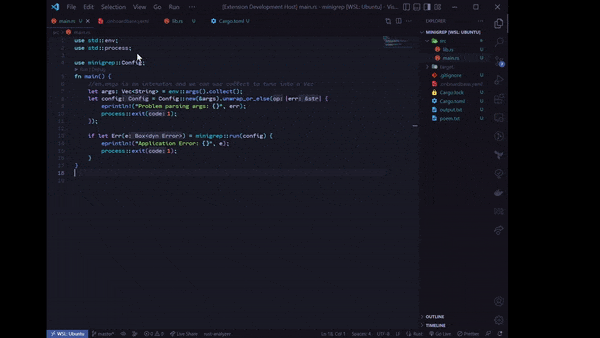
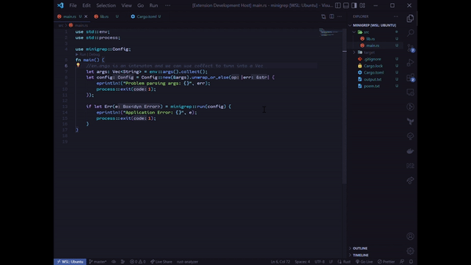
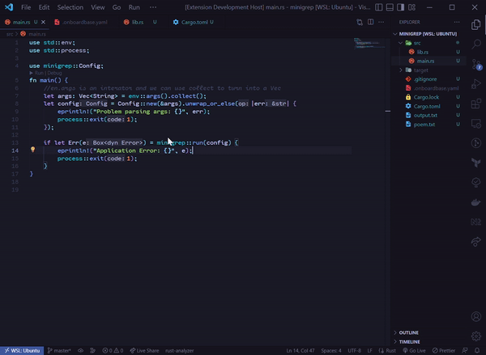
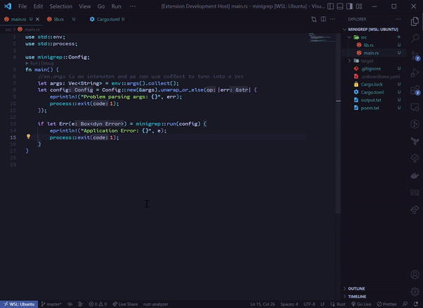

# Onboardbase for VSCode
 
Onboardbase is an app secret infrastructure for dev teams to securely share and work with environment-specific configs synced across every development stage, infrastructure and teammates without compromising security.

Our vscode extension provides easy access to secrets from local development to production in every development stage by retrieving, adding and uploading secrets without leaving the comfort of your text editor.

## Features

The extension enables uploading secrets to onboardbase, converting a text to a secret in your local config, setting up a project and a codelens over env files propmting addition of the secret to onboardbase.

To use the extension after installation, open the command pallete `cmd + shift + P` and type in one of the below commands:

- Login: `Onboardbase: Login To Onboardbase`
- Setup: `Onboardbase: Setup Project`
- Logout: `Onboardbase: Logout`
- Upload Secret: `Onboardbase: Upload Secret To Onboardbase`
- Add Secret to Local Config: `Onboardbase: Add Secret To Local Config`
- Merge Requests: `Onboardbase: Create Merge Request`
- Retrieve Secrets: `Onboardbase: Retrieve Secrets`
## Requirements

- vscode version 1.7.0 and above
- Node and NPM installed

## Feature Description

- Login: This command logs you in by opening a web browser from your vscode. 

- Setup: After logging in, and having access to projects, you can move on to setting up for your development environment by setting up the project.

- Logout: To revoke an authentication token, all you need to do is logout. 

- Add Secrets Locally: To add secrets to uour local environment, you can highlight a text and then run the Add command.

## Extension Settings

To enable codelens for `.env` files, the setting needs to be activated.

This extension contributes the following settings:

* `onboardbase-codelens.enableCodelens`: Enables/disables `.env` codelens.

## Release Notes

### 1.0.0

Initial release of the extension
